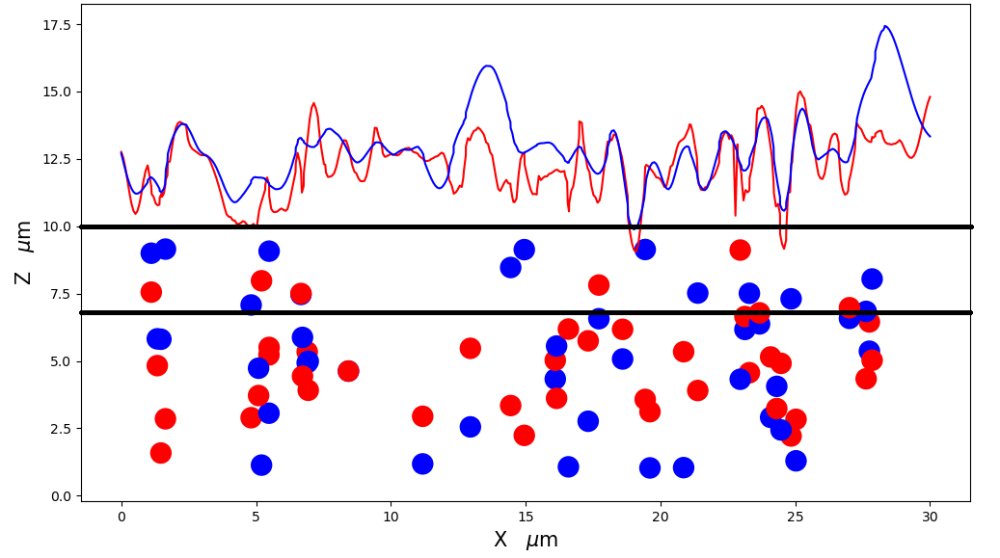

## Data Information

Physical parameters used for simulation:
 Particles were treated as single-domain particles interacting each other via dipolar interactions and with a uniform external applied magnetic field along the $z$-direction through a Zeeman interaction. Simulation was performed over 243 magnetite particles of 0.8 $\upmu m$ radius, inside a box of $30 \times 30 \times 10 \upmu m^3 $)

Surface parameters: 

$\tau_{x}$ = $\tau_{y}$=  0.4 $\upmu m$   
RMS = 2 $\upmu m$ 
    

## Figure Information

Cross section of the 3D surface for test 2 comparison of initial profile (red line) and modified profile (blue line). Parallel horizontal black lines represent the band of 30\% of the total height of the initial simulation box.