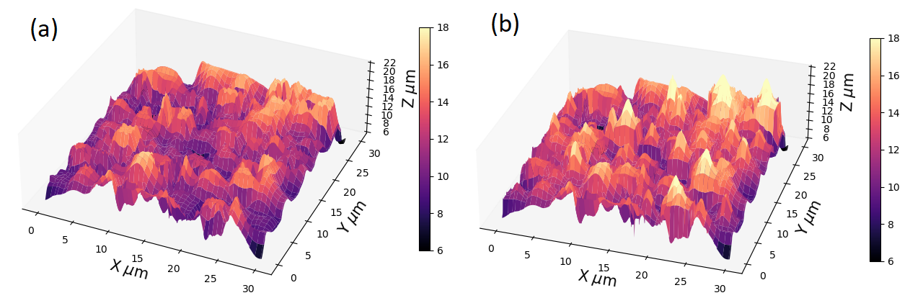

## Data Information

Physical parameters used for simulation:
(https://latex.codecogs.com/png.image?\dpi{110}&space; Particles were treated as single-domain particles interacting each other via dipolar interactions and with a uniform external applied magnetic field along the $z$-direction through a Zeeman interaction. Simulation was performed over 243 magnetite particles of 0.8 $\upmu$m radius, inside a box of 30 $\times$ 30 $\times$10 $\upmu$m$^3$)
  
   
   
    

## Figure Information

surface for the elastomer-magnetic particle system for test 1  with RMS height of \mbox{2 $\upmu$m}, \mbox{$\tau_{x}$ = 2 $ \upmu$m}, and $\tau_{y}$ = 2 $ \upmu$m  **a** Initial surface
without modification. **b** Surface modified by the movement of the particles